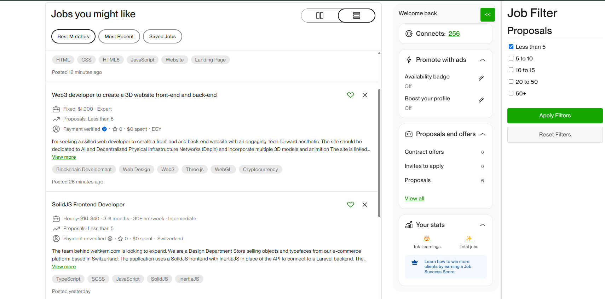

# Upwork Best Match and Most Recent Job Filter

This Chrome extension allows you to filter job listings on Upwork based on the number of proposals. It helps you quickly identify jobs with fewer proposals, increasing your speed selecting the jobs.

## Features

- Filter jobs by the number of proposals:
  - Less than 5
  - 5 to 10
  - 10 to 15
  - 20 to 50
  - 50+



## Installation

1. **Clone the Repository**: Clone this repository to your local machine using:

   ```bash
   git clone https://github.com/kave-me/upwork-job-filter.git
   ```

2. **Load the Extension in Chrome**:
   - Open Chrome and navigate to `chrome://extensions/`.
   - Enable "Developer mode" by toggling the switch in the top-right corner.
   - Click "Load unpacked" and select the directory where you cloned the repository.

## Usage

1. **Navigate to Upwork**: Go to the Upwork job listings page for Best Matches or Most Recent jobs.

2. **Open the Extension**: Click on the arrow icon in top right side of the page to open the sidebar.

3. **Apply Filters**: Use the checkboxes to filter jobs based on the number of proposals. Click "Apply Filters" to see the results.

4. **Reset Filters**: Click "Reset Filters" to clear all selections and view all jobs.

## Contributing

Contributions are welcome! Please fork the repository and submit a pull request for any improvements or bug fixes.

## License

This project is licensed under the MIT License - see the [LICENSE](LICENSE) file for details.
